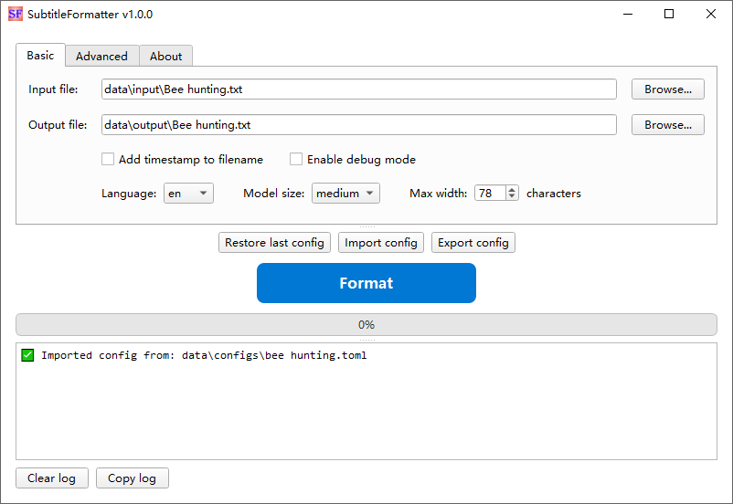

# Subtitle Formatter

Subtitle Formatter 是一个智能文本格式化工具，它能够进行智能断句、清理文本、处理停顿词并进行智能断行，使文本更加易读。



## 主要功能

1. 基础文本清理：统一空白字符、处理空行
2. 智能断句：使用语言模型进行智能断句
3. 停顿词处理：识别和处理文本中的停顿词
4. 智能断行：基于语法结构进行智能断行
5. 自定义：支持自定义最大行宽、多语言支持、详细的调试输出支持

## 安装

1. 确保已安装 uv：
   ```powershell
   # Windows (PowerShell)
   powershell -ExecutionPolicy ByPass -c "irm https://astral.sh/uv/install.ps1 | iex"
   ```
   ```bash
   # macOS/Linux
   curl -LsSf https://astral.sh/uv/install.sh | sh
   ```

2. 安装依赖并创建虚拟环境：
   ```bash
   uv sync
   ```

3. 设置语言模型：
   - 首次运行时，程序会自动下载 spaCy 语言模型
   - 模型存储位置：`models/` 目录（项目本地，重建环境时不会丢失）
   - 程序会优先从本地目录加载模型，如果不存在则从系统位置复制到本地
   - 若网络环境不佳，可预先手工下载语言模型（可选）：
   ```bash
   # 下载英文模型（推荐）
   uv run python -m spacy download en_core_web_sm --target models/
   uv run python -m spacy download en_core_web_md --target models/
   uv run python -m spacy download en_core_web_lg --target models/
   
   # 下载中文模型
   uv run python -m spacy download zh_core_news_sm --target models/
   uv run python -m spacy download zh_core_news_md --target models/
   uv run python -m spacy download zh_core_news_lg --target models/
   ```

## 使用方法

**启动应用**

- **GUI模式**（默认）：
  ```bash
  uv run subtitleformatter
  ```
  启动图形界面，提供直观的操作界面

- **CLI模式**：
  ```bash
  uv run subtitleformatter --cli [--config path/to/config.toml]
  ```
  命令行模式，支持可选的配置文件参数
   - 默认配置：不指定 `--config` 参数时，使用 `data/configs/config_latest.toml`
   - 相对路径：优先从 `data/configs/` 目录查找，如 `--config config.toml` 会查找 `data/configs/config.toml`
   - 绝对路径：直接使用完整路径，如 `--config /path/to/config.toml`

**基本处理流程**：
   - 在 Basic 标签页设置输入输出文件和参数
   - 点击中央的"Format"按钮开始处理
   - 实时查看处理进度和日志输出
   - 处理完成后查看输出文件

**Basic 标签页**：
   - **输入文件**：点击"Browse..."按钮选择要处理的文本文件，或直接在文本框中输入文件路径
   - **输出文件**：点击"Browse..."按钮选择输出位置，或直接在文本框中输入文件路径
   - **配置选项**：
     - 添加时间戳到文件名：勾选后输出文件名会包含时间戳
     - 启用调试模式：勾选后显示详细的处理日志
     - 语言设置：选择 auto/en/zh
     - 模型大小：选择 small/medium/large
     - 最大宽度：设置文本行的最大字符数（20-200）

**配置文件**:
- 所有配置信息，可存入 .toml 配置文件，以供今后直接调用
- 配置文件默认存放在 `data/configs/` 目录
- **Restore last config**：恢复上次使用的配置
- **Import config**：从TOML文件导入配置
- **Export config**：将当前配置导出为TOML文件
- 恢复默认配置：在 Advanced 标签页，点击"Restore default config"按钮重置配置

**项目目录结构**：
   - `data/`：用户数据目录
     - `configs/`：配置文件目录
     - `input/`：输入文件目录
     - `output/`：输出文件目录
     - `debug/`：调试输出目录
   - `models/`：语言模型目录（spaCy模型存储位置）
   - 打开用户数据所在路径：在 Advanced 标签页，点击"Open"按钮打开数据目录

## 脚本工具

SubtitleFormatter 提供了一系列独立的脚本工具，用于各种文本处理和格式转换任务。

### 快速开始
```bash
# 列出所有可用脚本
uv run python scripts_manager.py list

# 运行句子分割工具
uv run python scripts_manager.py sentence-splitter input.txt --output output.txt

# 显示特定脚本的帮助信息
uv run python scripts_manager.py help text-diff
```

### 可用脚本

#### 文本处理工具
- **text-diff**: 智能文本差异检测和对比工具
- **text-to-sentences**: 文本断句工具
- **sentence-splitter**: 高级句子分割工具
- **punctuation-adder**: 智能标点符号添加工具

#### 字幕格式工具
- **clean-vtt**: VTT 字幕文件清理工具
- **srt-resegment**: SRT 字幕重分段工具
- **transcript-converter**: 字幕格式转换工具

#### 其他工具
- **batch-replace**: 批量文本替换工具（Vim 脚本）
- **txt-resegment**: 文本重分段工具（Vim 脚本）
- **release**: 版本发布和打包工具

### 使用说明
- **用户指南**: 详细使用说明请参考 [脚本使用指南](docs/scripts_guide.md)
- **开发者文档**: 技术实现和架构说明请参考 [Scripts_Development_Guide.md](scripts/Scripts_Development_Guide.md)
- **依赖管理**: 各脚本的依赖通过 `uv` 自动管理，无需手动安装

## License

This project is licensed under the **GNU General Public License v3.0 (GPL-3.0)**.

This means:
- You are free to use, modify, and distribute this software
- Any derivative works must also be licensed under GPL-3.0
- You must make the source code available when distributing the software
- You must preserve copyright notices and license information

For more details, see the [LICENSE](LICENSE) file or visit [https://www.gnu.org/licenses/gpl-3.0.html](https://www.gnu.org/licenses/gpl-3.0.html).
